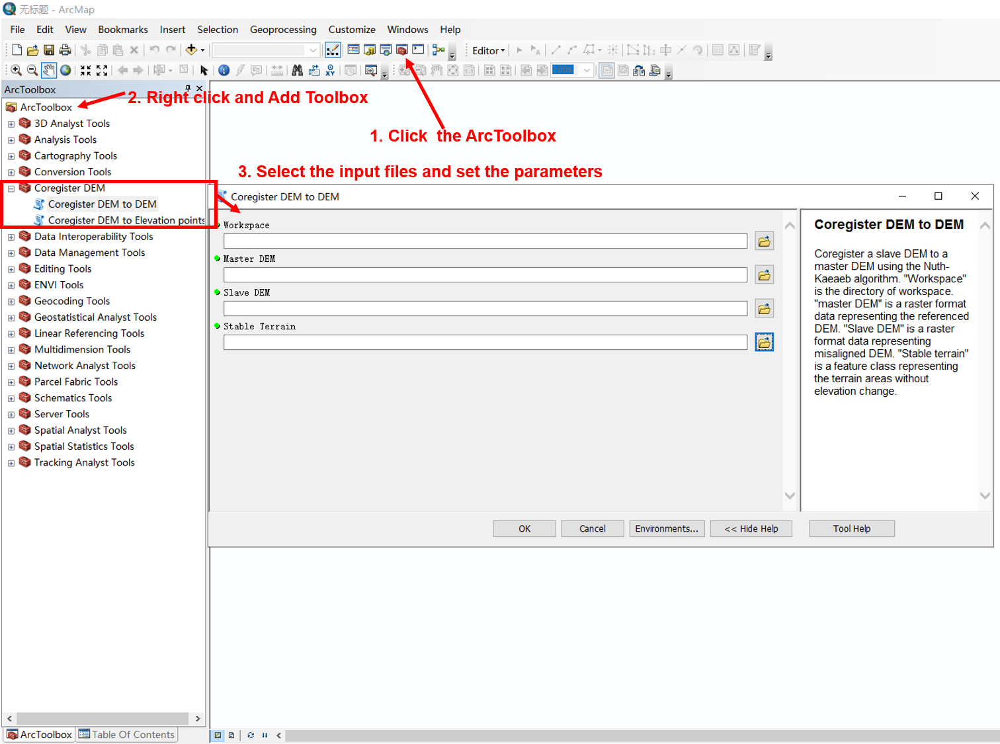

# arcPycor
arcPycor can automatically align the geolocation of DEMs and elevation points (e.g. ICESat, LiDAR) by specifying stable terrain areas. We provide two modes of arcPycor, i.e. ArcToolbox mode and standalone mode.

arcPycor was developed by Dr. Yuzhe Wang (wangyuzhe AT ucas.ac.cn), now a postdoc at the University of Chinese Academy of Sciences.

# Implementation
**Dependencies**:

* python2.7

* arcpy

* scipy

* numpy

arcPycor is executed as a standard ArcGIS geoprocessing toolbox in ArcMap. To add the toolbox, open an ArcMap document, click the toolbox button, right click in the ArcToolbox window and select ‘Add Toolbox’. Navigate to the folder downloaded from the VOLTA github site and select the toolbox file (‘Coregister_DEM.tbx’). Coregister_DEM will now appear in the list, containing two tools: **Coregister DEM to DEM** and **Coregister DEM to Elevation points**.

To co-register elevation datasets, open the Coregister_DEM’ tool and specify the parameters as described below.

**Workspace**: Set the workspace

**Master DEM**: Select the master DEM (any raster format)

**Slave DEM**: Select the slave DEM (any raster format)

**Stable Terrain**: Select the stable terrain areas (shapefile)

**Master Elevation points**: Select the elevation points (shapefile)

**Elevation field name**: Set the field name representing the elevation of 'Master Elevation points' (e.g. z)

